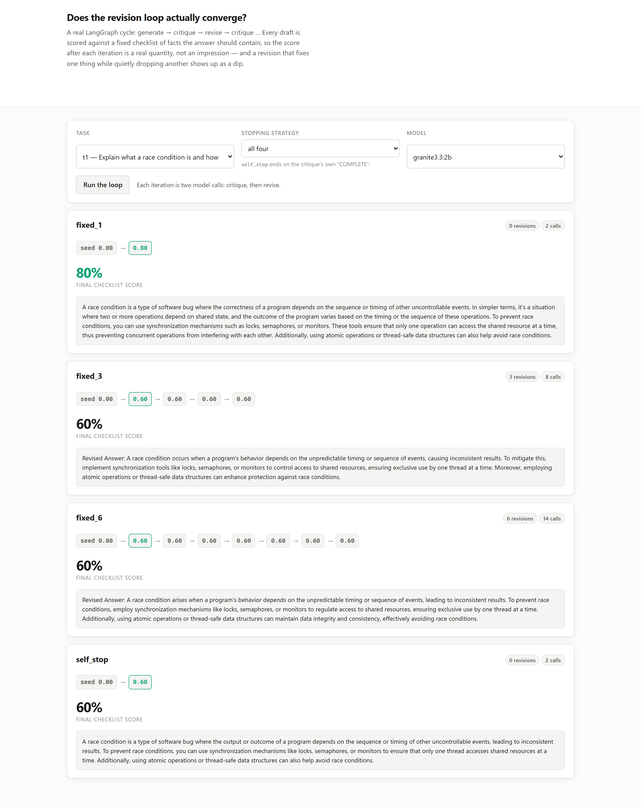

# 01 · Does the revision loop actually converge?

**Doubling the loop from 3 iterations to 6 produced zero additional improvement on every one
of six tasks. Letting the critique node decide when to stop made it quit on the very first
draft, every single time.**

A real LangGraph cycle — `generate -> critique -> revise -> critique -> ...` — is the pattern
LangGraph exists for: it is a cycle, not a chain, and LCEL cannot express an unbounded loop
whose length depends on what a node inside it decides. Every demo of this pattern assumes more
iterations help. This project checks that assumption against a fixed checklist of facts each
answer should contain, so "improved" is a number and not an impression.

---

## The result

| strategy | mean score | mean iterations | mean calls | regressed |
|---|---|---|---|---|
| `fixed_1` (no revision) | 27% | 0.0 | 2.0 | 0/6 |
| `fixed_3` | **37%** | 3.0 | 8.0 | 0/6 |
| `fixed_6` | **37%** | 6.0 | 14.0 | 0/6 |
| `self_stop` | 27% | **0.0** | 2.0 | 0/6 |

`fixed_3` and `fixed_6` score **identically** — 37% either way — for 75% more model calls.
Every task's score trajectory is flat past iteration 3:

```
t1  0.40 -> 0.40 -> 0.40 -> 0.40 -> 0.40 -> 0.40 -> 0.40   (fixed_6, 6 revisions, no change)
t3  0.00 -> 0.00 -> 0.00 -> 0.00 -> 0.00 -> 0.00 -> 0.00   (stuck at zero for the whole loop)
t6  0.40 -> 0.40 -> 0.40 -> 0.40 -> 0.40 -> 0.40 -> 0.40
```

Only two of six tasks (`t4`, `t5`) improved at all beyond iteration 1, and both had finished
improving by iteration 3. The other four plateau immediately and stay there through three more
full critique-revise cycles.

## The self-stopping signal quits immediately

`self_stop` lets the critique node end the loop by writing the single word `COMPLETE` instead
of a list of problems. On **all six tasks**, it did — on the very first draft, before a single
revision:

```
self_stop  t1: 0.40  (1 recorded round, 0 revisions)
self_stop  t3: 0.00  (1 recorded round, 0 revisions)
```

`self_stop`'s mean score (27%) equals `fixed_1`'s exactly, because it behaved exactly like
`fixed_1` — the critique node approved a 27%-complete first draft as `COMPLETE` on every task.
A model asked to judge its own generation's completeness is not a reliable stopping condition;
here it is indistinguishable from never checking at all.

## What "plateau" looks like when you read it

`t3` scores 0.00 through the entire six-iteration loop. That is not a scorer bug — the
checklist words (`old code`, `deploy`, `rollback`, `downtime`, `column`) are ordinary ways a
correct answer would state these ideas, and `t3`'s final draft after three revisions reads:

> *"Database migrations should be backward compatible to ensure that data and schema changes do
> not break existing applications or data, maintaining system stability and ensuring a
> seamless user experience across different versions, thereby preserving the integrity and
> functionality of the system."*

Fluent, plausible, and it says nothing a checklist could catch as concrete: no old code running
against a new schema, no deployment step, no rollback, no downtime, no column. Three more
revisions after this did not change a word of substance. The critique-revise loop is fixing
what the critique node notices, and the critique node here never noticed that the answer had
become abstraction with no technical content in it.

## What this means for a real loop

1. **Cap the loop, and cap it low.** Every measured improvement here happened by iteration 3;
   the extra compute of `fixed_6` bought nothing on this corpus.
2. **Do not trust a model's own "I'm done."** `self_stop` is not a safety margin against
   over-looping — on this run it under-loops on every task, which is the more expensive
   failure to catch because it looks like a working feature.
3. **A revision loop is not a substance check.** It can converge — cleanly, with no regression
   detected — on an answer that has lost all technical content, because "regressed" here means
   the score went down, and a plateau at zero is not a regression by that definition.

## Run it

```bash
make install
ollama pull qwen2.5:3b-instruct

uv run python -m projects.p01_revision_loops.benchmark
uv run uvicorn projects.p01_revision_loops.web:app --port 8111
```

The UI runs the real graph live and renders the score trace as a strip of steps, so a plateau
or a dip is visible at a glance:



## What this does NOT do

- **One model, one size.** `qwen2.5:3b-instruct`. A model that self-assesses more reliably
  would change the `self_stop` result specifically; the plateau result is a property of the
  compute-per-iteration trade and is likely to generalise further.
- **The checklist scorer is coarse.** It checks substring presence, not correctness of the
  surrounding sentence. A draft could in principle contain every checklist word arranged
  incorrectly and still score 100%. It has not been observed to do so in this corpus, but the
  instrument does not rule it out.
- **It does not test a supervisor deciding to stop from outside the loop** — only the critique
  node's own self-report. An external judge checking the same checklist is a different, and
  probably more reliable, design; it is not what most `generate -> critique -> revise` tutorials
  build.
- **Six tasks.** Enough to see a flat trajectory on four of six and a self-stop failure on all
  six; not enough to put a confidence interval on either rate.

## Problems hit while building this

- **A `dataclass` merge for LangGraph state.** `LoopState` is a `TypedDict`, and every node
  returns `{**state, "field": new_value}` rather than mutating in place — LangGraph's default
  reducer replaces a state key outright, so a node that forgot to spread the incoming state
  would silently drop everything written before it.
- **The `t3` 0.00 trace looked like a scorer bug** until the draft text was actually read. It
  was a real finding: fluent, technically empty prose that neither the model's own critique nor
  three additional revisions ever flagged.
