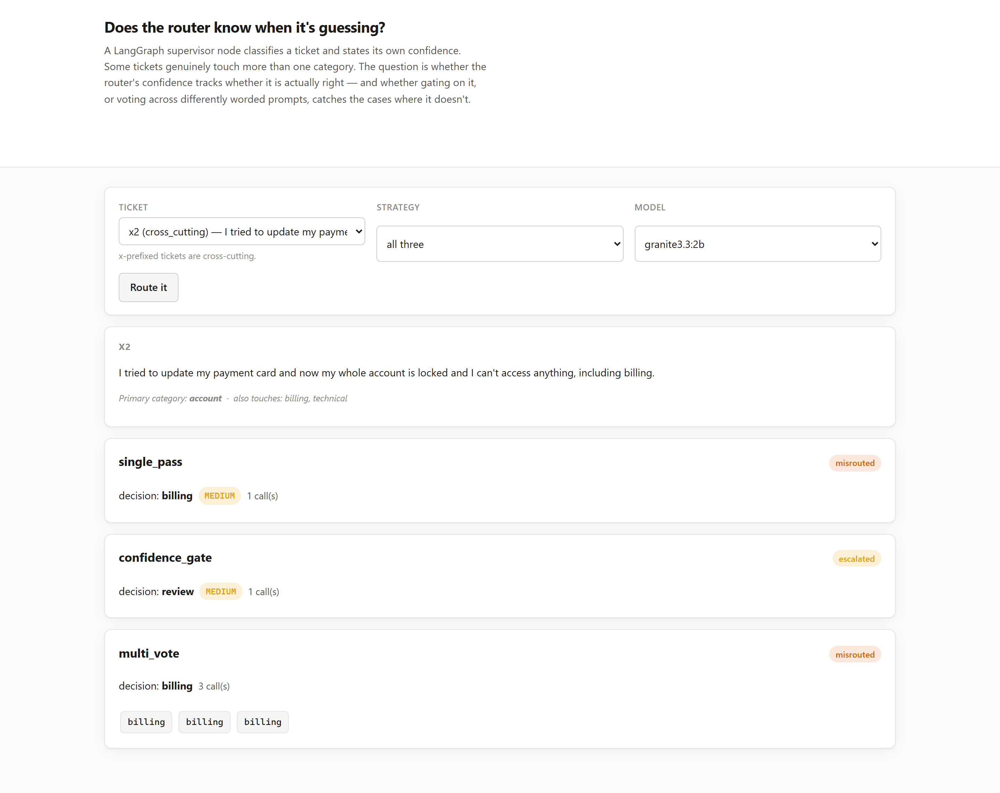

# 02 · Does the router know when it's guessing?

**Gating on the router's own confidence dropped accuracy on unambiguous tickets from 100% to
33% — because the router is systematically *unconfident about tickets it gets right* and
*confident about the one it gets wrong*.**

A LangGraph supervisor node classifies a support ticket into one of four categories and states
its own confidence. Twelve tickets: six unambiguous, six genuinely cross-cutting (a customer
locked out of an account they were also billed for). Three dispatch strategies share one
classifier and differ only in what they do with its output.

---

## The result

| strategy | clean accuracy | cross-cutting accuracy | escalated | wrong+confident | calls |
|---|---|---|---|---|---|
| `single_pass` | **100%** | 33% | 0% | 1/6 | 12 |
| `confidence_gate` | **33%** | 33% | 50% | 1/6 | 12 |
| `multi_vote` | 83% | 33% | 17% | 0/6 | 36 |

Gating dispatch on confidence — send it straight through only if the router says HIGH,
otherwise hold for human review — is the obvious defence against a confident misroute. It is
also, on this run, a **net loss**: it turns four correctly classified, completely unambiguous
tickets into unnecessary escalations, while barely touching the one ticket it was built to
catch.

## Confidence runs backwards

Every clean ticket was classified into the *correct* category by every strategy. The gate did
not fail because the router got the answer wrong — it failed because the router would not say
it was sure of an answer that was, in fact, right:

| ticket | category chosen | confidence | correct |
|---|---|---|---|
| c2 (app crashes on settings page) | technical | MEDIUM | yes |
| c3 (change my account email) | account | MEDIUM | yes |
| c4 (business hours?) | general | MEDIUM | yes |
| c6 (export produces empty files) | technical | MEDIUM | yes |

Four unambiguous tickets, four correct classifications, four **MEDIUM** confidence readings —
so `confidence_gate` escalated all four to `review` for no reason. Meanwhile, on the one
genuinely hard ticket in the corpus:

| x2 (payment update locked me out of everything, including billing) | billing | **HIGH** | **no** — true category is `account` |

The router was most sure of itself exactly where it was wrong, and unsure of itself on
questions a support team would consider trivial. Confidence here is not merely uncalibrated —
on this run it points the wrong way often enough that gating on it costs more than it saves.

## Voting doesn't fix a shared bias

`multi_vote` asks three independently worded versions of the same question and takes the
majority. It recovers the clean-ticket losses (83% against `confidence_gate`'s 33%) because
disagreement across phrasings is a real signal there. It does **not** fix `x2`:

```
x2  primary=account   votes = billing, billing, technical   ->  billing (wrong)
```

Two of three differently worded prompts landed on the same wrong category. The error is not
noise that independent samples average away — it is a shared bias in how the model reads this
particular ticket, and asking three times just outvotes the one prompt that got it right.

`x6` is the case where the design worked as intended: three genuinely split votes
(`account, billing, technical`) with no majority, correctly escalated to `review` rather than
guessing.

## What this means for a real router

1. **A confidence gate is a bet that confidence is informative in the direction you need.**
   Verify that before shipping it — this run shows a case where escalating on *low* confidence
   discards good answers, because the failures cluster at HIGH.
2. **Self-consistency catches disagreement, not shared bias.** It fixed the tickets where
   different phrasings produced different answers, and missed the one where they agreed on the
   wrong one.
3. **Measure clean-ticket accuracy under any safety mechanism you add**, not only the
   hard-case accuracy it targets. The defence built for `x2` quietly broke four tickets that
   never needed one.

## Run it

```bash
make install
ollama pull qwen2.5:3b-instruct

uv run python -m projects.p02_router_misroute.benchmark
uv run uvicorn projects.p02_router_misroute.web:app --port 8112
```

The UI runs the router live on any ticket under any strategy and shows every vote beside its
confidence:



## What this does NOT do

- **One model, twelve tickets.** Enough to show the direction of the effect; not enough to
  claim a rate. A larger or differently trained model's confidence could easily be calibrated
  in the other direction, or in no direction at all.
- **Confidence is self-reported as a word (LOW/MEDIUM/HIGH), not a log-probability.** A
  genuine calibration study would use token probabilities; this measures what a router that
  states its confidence in prose actually does, which is closer to how most LangGraph
  supervisor demos are written.
- **`multi_vote` triples the model calls.** Its clean-ticket recovery is real but it is not
  a free win, and the benchmark reports the call count so the trade is visible.
- **The "primary" label on a cross-cutting ticket is a judgement call**, stated as the category
  a support team would route it to first. Two of the twelve tickets' `also` fields could
  reasonably be argued the other way; the corpus documents the call rather than hiding it.

## Problems hit while building this

- **`confidence_gate`'s 33% clean accuracy looked like a bug** before the per-ticket data was
  read. It was not: the router was getting the category right and reporting MEDIUM, and the
  gate correctly did what it was told to do with a MEDIUM reading. The instrument worked; the
  premise that confidence tracks correctness did not.
- **The call-count design was written as a list of ledgers from the start**, not a bare one,
  because `langchain-lab` had already found that `chat(..., callbacks=[single_handler])` drops
  a second handler passed separately — a lesson applied here rather than re-discovered.
