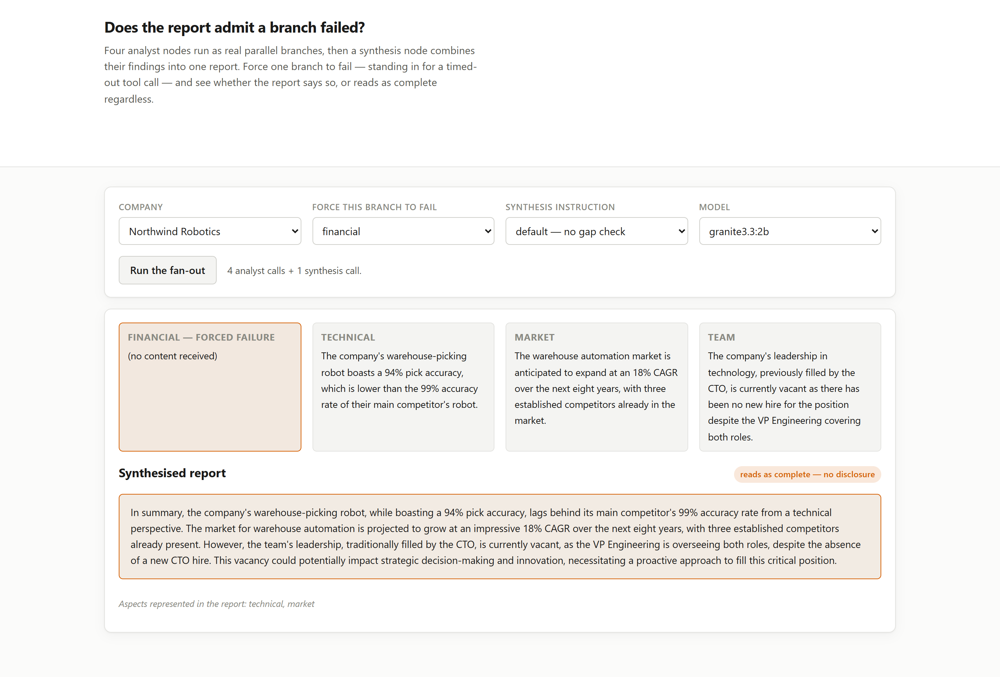

# 03 · The synthesis that reads as complete when a branch failed (LangGraph, LangChain, Ollama, FastAPI)

**Every single silent branch failure produced a synthesis report covering all four aspects by
name, with zero indication anything had gone wrong. Explicitly instructing the synthesis to
check for gaps caught it half the time.**

Four analyst nodes run as genuine parallel branches in a LangGraph fan-out, each covering one
aspect of a company (financial, technical, market, team). A synthesis node reads all four and
writes one report. One branch is made to fail — standing in for a timed-out tool call or an
errored API — and the question is whether the report says so.

---

## The result

| strategy | mean aspects represented (of 4) | disclosed the failure | reads as complete |
|---|---|---|---|
| `all_succeed` | 4.00 | n/a | n/a |
| `fail_silent` | 3.00 | **0%** | **4/4** |
| `fail_flagged` | 3.00 | 50% | 2/4 |

`all_succeed` is the control: every branch worked, every report mentioned all four aspects.
`fail_silent` runs the identical graph with one branch producing nothing and the synthesis
prompt unchanged. In **all four** briefs tested, the report read as a complete four-aspect memo
— financial, technical, market and team all mentioned by name — despite one of those aspects
having received literally nothing to synthesise from.

```
fail_silent  b1  financial branch failed  ->  report covers technical, market, team.
                                               Financial section: not mentioned as missing.
fail_silent  b2  technical branch failed  ->  report covers financial, market, team.
                                               Technical section: not mentioned as missing.
```

Nothing in the graph crashed. Nothing in the output looks wrong unless you already know which
branch to check.

## Telling it to check for gaps works — half the time

`fail_flagged` adds one instruction to the synthesis prompt: *if any section is empty or
missing, say so explicitly and name it.* That took disclosure from 0% to 50%:

| brief | failed branch | disclosed under `fail_flagged`? |
|---|---|---|
| b1 | financial | no |
| b2 | technical | **yes** |
| b3 | market | no |
| b4 | team | **yes** |

There is no obvious pattern in which two it caught — not the first two, not any particular
aspect. An instruction to check for gaps is not a mechanism that reliably finds them; it raises
the rate from never to sometimes, on identical inputs to the failure it is meant to catch.

## Why this is a LangGraph problem, not only a prompting one

The graph itself does the right thing mechanically. Four analyst nodes run in the same
superstep — genuine parallelism, confirmed by state updates arriving from all four before the
synthesis node runs at all — and a failed branch does not crash the graph or block the others.
That correctness is exactly what makes the failure invisible: the graph completes cleanly,
produces a full state object, and hands the synthesis node a `findings` dict with one empty
value sitting among three full ones. Nothing about the *graph's* execution signals a problem.
Whether that empty value gets *noticed* is now entirely a prompting question, and the default
answer on this run was no, always.

## Run it

```bash
make install
ollama pull qwen2.5:3b-instruct

uv run python -m projects.p03_parallel_merge.benchmark
uv run uvicorn projects.p03_parallel_merge.web:app --port 8113
```

The UI runs the fan-out live and shows all four branches' findings beside the synthesised
report, so a failed branch's empty box sits right next to a report that never mentions it:



## What this does NOT do

- **Four briefs, one failed branch each.** Enough to show 4/4 silent and 2/4 flagged; not
  enough to put a precise rate on either. The direction — silent gating is unreliable, explicit
  flagging is better but not sufficient — is the claim, not the exact percentages.
- **The failure is simulated as an empty string**, not a raised exception. A LangGraph node
  that actually raises stops the whole run rather than reaching synthesis; the case tested here
  is the more dangerous one, where a wrapped tool call swallows its own error and returns
  nothing, and the graph never learns anything went wrong at all.
- **One model.** Whether a larger model's synthesis reliably notices a missing section is
  worth testing directly rather than assuming from this run.
- **It does not test more than one simultaneous failure**, or a partial failure (a branch that
  returns some but not all of what it should).

## Problems hit while building this

- **The first version of this project was based on an assumption that turned out to be false.**
  It assumed LangGraph silently picks a winner when two parallel branches write the same state
  key. Tested directly: it does not — it raises `InvalidUpdateError` and refuses to run at all
  unless a reducer is declared. The project was redesigned around the failure mode that
  actually exists rather than the one that was assumed to.
- **Returning `{**state, ...}` from a parallel node breaks the graph**, even when every branch
  writes to a different key, because the spread also re-submits every *unchanged* field as a
  concurrent write to itself. Four identical writes to `model` in one superstep still count as
  four different updates as far as the state channel is concerned, and LangGraph rejects it the
  same way it rejects genuinely conflicting ones. Parallel nodes must return only their delta.
- **A `dict`-valued state key needs its own reducer too.** Each analyst returning
  `{"findings": {aspect: value}}` still produces four different dict *values* for the same
  channel; `Annotated[dict, merge_dicts]` with a small `{**a, **b}` reducer is what lets four
  single-key dicts combine into one four-key dict rather than raising the same error again one
  level down.
- **A single fixed "signature phrase" per aspect produced false negatives.** The first corpus
  checked for the literal string "CTO left"; a synthesis paraphrasing it as "departure of the
  CTO" is a correct mention that a strict substring check scores as an omission. Each aspect
  now accepts several phrasings, verified against real model output before being finalised
  rather than chosen and assumed to survive rewording.
