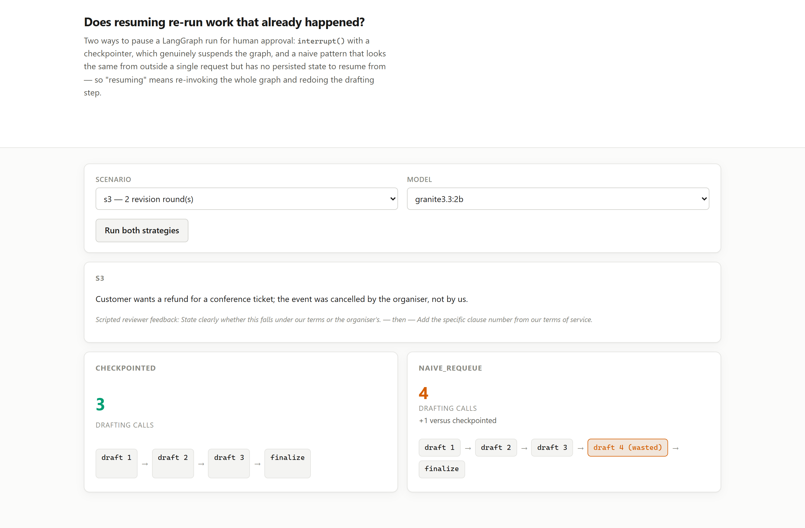

# 04 · Does resuming re-run work that already happened? (LangGraph, LangChain, Ollama, FastAPI)

**A "pause for approval" pattern that looks identical to LangGraph's real one from outside a
single request cost 50% more drafting calls across three scenarios — one wasted call every
single time, for behaviour that never crashes and never looks wrong.**

LangGraph ships an actual mechanism for human-in-the-loop: `interrupt()` inside a node, plus a
checkpointer, genuinely suspends a run and resumes it later without re-entering nodes that
already finished. It is easy to build something that looks the same without knowing that
exists — a node that checks an "approved" flag and ends the run if it is not set, with the
caller re-invoking the whole graph from the original input once a decision arrives. This
project puts a real drafting step in front of both and counts how many times it actually runs.

---

## The result

| scenario | revision rounds | checkpointed draft calls | naive draft calls | extra |
|---|---|---|---|---|
| s1 | 0 | 1 | **2** | +1 |
| s2 | 1 | 2 | **3** | +1 |
| s3 | 2 | 3 | **4** | +1 |

**Every scenario, exactly one extra drafting call**, regardless of how many rounds of revision
happened first. `s1` needs no revision at all — the reviewer approves the first draft — and the
naive strategy still drafts twice.

| strategy | total draft calls | total finalize calls |
|---|---|---|
| `checkpointed` | 6 | 3 |
| `naive_requeue` | **9** | 3 |

**50% overhead**, for a result that is otherwise correct: `finalize` runs exactly once in both
strategies, and both eventually produce an approved refund decision. Nothing crashes. Nothing
in the output signals that anything was wasted.

## Where the extra call comes from

The naive graph is structured `draft -> gate -> (finalize or end)`, and `draft` is
unconditional — every invocation runs it, with no way to skip straight to `finalize` on the
call that only exists to say "go ahead." That call happens exactly once per approval, no matter
how many revisions preceded it, which is why the overhead is a **flat +1** rather than
something that scales with the number of rounds:

```
naive s1 (0 revisions):  draft(1) -> gate -> [pending] -> draft(2, wasted) -> gate -> finalize
naive s3 (2 revisions):  draft(1) -> draft(2) -> draft(3) -> draft(4, wasted) -> finalize
```

The checkpointed strategy's `gate` genuinely pauses inside `interrupt()`. Resuming with
`Command(resume="approve")` continues execution from exactly where it stopped — inside `gate`,
not from `START` — so the router sends it straight to `finalize` without touching `draft` again.

## What this means for a real system

The drafting node here is a stand-in. In a real approval flow it could be an LLM call (as
tested), a reservation held against inventory, or a request to an external pricing API — and
"redone once per approval, forever" is a permanent tax on every approved action for as long as
the naive pattern remains in place, invisible in production because the final output is
correct either way. The fix is not a code review catching a bug; it looks fine on review,
because it works. The fix is knowing `interrupt()` exists.

## Run it

```bash
make install
ollama pull qwen2.5:3b-instruct

uv run python -m projects.p04_checkpoint_resume.benchmark
uv run uvicorn projects.p04_checkpoint_resume.web:app --port 8114
```

The UI runs both strategies live on the same scenario and lays out every drafting call as a
strip of steps, with the naive strategy's wasted final call marked:



## What this does NOT do

- **Three scenarios, one model.** Enough to show the overhead is flat rather than scaling with
  revision count; not enough to claim the exact multiplier generalises past this task shape.
- **The naive graph is one specific way to get this wrong**, chosen because it is the version
  that does not require knowing anything about LangGraph's checkpointing API — an early-return
  plus a fresh `invoke()`. Other naive designs exist and would cost differently.
- **It does not measure the cost of a genuinely dropped or duplicated side effect** — `finalize`
  runs exactly once under both strategies here. A naive design where the *finalizing* step
  itself gets re-run (double-charging a card, sending two emails) is a worse failure mode this
  project's scenarios do not happen to trigger, because `approved` only ever transitions from
  false to true once per run.
- **`MemorySaver` only.** A production checkpointer (Postgres, Redis) changes durability across
  process restarts, not the call-count behaviour measured here.

## Problems hit while building this

- **A live `Ledger` object cannot live inside checkpointed graph state.** The first version put
  it there, matching every other project in this repo. LangGraph's checkpointer serialises
  state between invocations, so each resume operated on a **deserialised copy** disconnected
  from the `Ledger` instance the benchmark was reading — real model calls kept happening, the
  copy kept counting them, and the external count silently stayed at 1 regardless of how many
  resumes occurred. The fix keeps call counters in a plain module-level registry keyed by a
  checkpoint-safe string, never inside the graph's own state.
- **The naive strategy's first draft was measured as its whole cost.** An early version's loop
  conflated "get the initial draft" with "the final approval call" whenever a scenario had zero
  revision rounds, so `s1` measured 1 draft call for naive instead of 2 and reported no overhead
  at all on the simplest scenario. Restructuring the loop into three explicit phases — initial
  draft, one call per revision round, one final approval call — fixed it and is what the "flat
  +1 regardless of revision count" result depends on.
